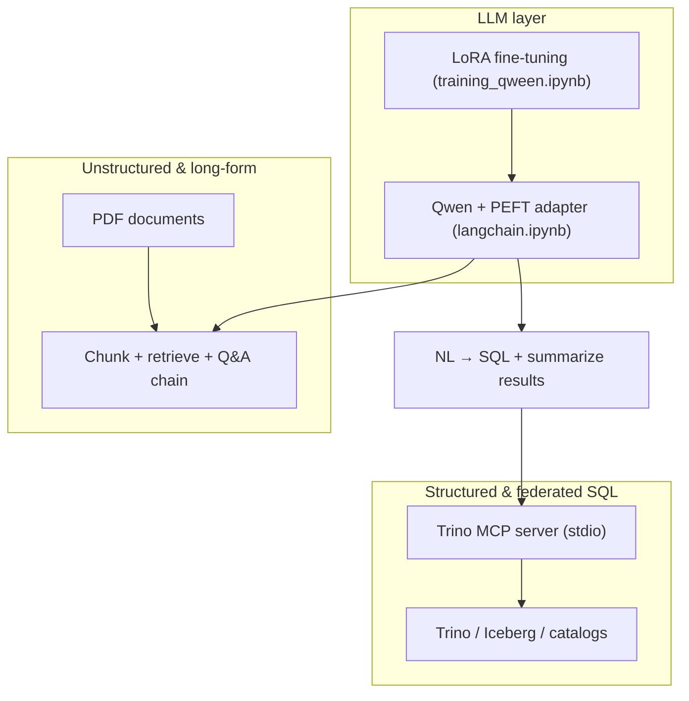

# LLM Analytics Assistant

**Fine-tuned instruction models, retrieval over documents, and natural language to Trino SQL** — built so analysts and engineers can move from *questions in plain language* to *grounded answers and queryable data* across **structured** (tables in Iceberg/Hive-style catalogs), **semi-structured** (JSON-like columns, nested types where exposed), and **unstructured** (PDFs and long-form text) sources.

This repository shows an end-to-end pattern: **train or load a Q&A-oriented LLM**, **ground responses with NLP retrieval**, and **delegate tabular work to Trino** via **LangChain** and a **Model Context Protocol (MCP)** tool server.

---

## Why this project

Modern analytics stacks store truth in the warehouse (Trino as the federated query engine) while decisions still start in natural language. This project demonstrates:

- **Parameter-efficient fine-tuning (LoRA)** on instruction-style Q&A data so the model follows context-bound answering behavior.
- **LangChain** orchestration around a **Hugging Face** causal LM (base + adapter) for reproducible pipelines.
- **Lightweight RAG** over **unstructured** PDFs (chunking, lexical scoring, grounded generation).
- **Text-to-SQL** against live **Trino** metadata: schema introspection → read-only SQL → execution via MCP tools → **NL summarization** of result sets for actionable takeaways.

Together, that is a credible story for **ML / NLP**, **data engineering**, and **analytics engineering** roles.

---

## Architecture



---

## What lives where

| Path | Role |
|------|------|
| [`api/training_qween.ipynb`](api/training_qween.ipynb) | **Fine-tuning**: Qwen family models with **LoRA** (`peft`), **SQuAD**-style chat formatting, manual PyTorch training loop, **MLflow** metrics and artifacts, optional **Hugging Face Hub** publish for the adapter. |
| [`api/langchain.ipynb`](api/langchain.ipynb) | **Inference & integration**: load base + adapter, **LangChain** `HuggingFacePipeline`, **PDF RAG** (`pypdf`, `RecursiveCharacterTextSplitter`, lexical retrieval), **Trino MCP** client (`langchain-mcp-adapters`), `ask_trino` **NL → SQL → query → summary** flow. |
| [`api/env_loader.py`](api/env_loader.py) | Loads **`env.sample`** then **`.env`**, creates `.env` from the sample when missing, and resolves **Trino MCP** paths (Windows / Linux venv). |
| [`api/notebook_bootstrap.py`](api/notebook_bootstrap.py) | One import for notebooks so **cwd** can be repo root, `llm/`, or `llm/api/`. |
| [`api/download_hf_model.py`](api/download_hf_model.py) | Snapshot a Hub model to `./hf_models/...` for offline use (respects `HF_ENDPOINT` for mirrors). |

The Trino side uses a **local MCP server**. Set **`TRINO_MCP_DIR`** and optionally **`TRINO_MCP_PYTHON`** in `.env`; otherwise paths default to **`<workspace>/mcp`** (parent of `llm/`) with `.venv/Scripts/python.exe` on Windows or `.venv/bin/python` on Linux/WSL.

---

## Tech stack

- **Models**: Qwen instruction checkpoints (e.g. `Qwen2.5-*-Instruct`); optional larger Qwen3 MoE IDs with a recent `transformers` build.
- **Fine-tuning**: `peft` (LoRA), `accelerate`, `datasets` (e.g. `squad`).
- **Orchestration**: LangChain (`langchain-core`, `langchain-huggingface`, `langchain-mcp-adapters`).
- **Warehouse**: Trino (read-oriented SQL generation in the demo).
- **Experiment tracking**: MLflow.
- **Distribution**: Hugging Face Hub for tokenizer + adapter artifacts.

---

## Getting started

### 1. Environment

Create a virtual environment, then from `llm/api`:

```bash
pip install -r requirements.txt
```

Use a **GPU** for reasonable fine-tuning and inference latency; the training notebook supports **CPU** for small smoke runs at the cost of speed.

### 2. Secrets and configuration

1. Copy **`api/env.sample`** → **`api/.env`** (or run any notebook / `download_hf_model.py` once: missing `.env` is created automatically from the sample).
2. Edit **`.env`**: set **`HF_TOKEN`**, **`ADAPTER_REPO`** / **`HF_REPO_ID`**, and optional **`TRINO_MCP_DIR`** / **`TRINO_MCP_PYTHON`**.

| Variable | Purpose |
|----------|---------|
| `HF_TOKEN` | Hugging Face read/write for private or gated models and adapter repos. |
| `BASE_MODEL` | Base model id (default in sample is small **Qwen2.5-0.5B-Instruct**). |
| `ADAPTER_REPO` | Hub id for the LoRA adapter used in `langchain.ipynb`. |
| `HF_REPO_ID` / `HF_PRIVATE` | Target Hub repo when publishing adapters after training. |
| `TRINO_MCP_DIR` / `TRINO_MCP_PYTHON` | Paths to your **MCP** checkout and its venv Python (optional if `../mcp` matches your tree). |

For Trino JDBC/catalog settings, use the **MCP server’s** own `.env`.

### 3. Docker (optional)

From **`llm/`**:

```bash
docker compose up --build
```

Open Jupyter Lab at **http://localhost:8888** and use the printed token. The `api/` folder is bind-mounted so notebook edits persist.

### 4. Run the notebooks

1. **`training_qween.ipynb`** — Run from **cwd** = repo root, `llm/`, or `llm/api/`. Section 2 loads env via `notebook_bootstrap`. Configure `params`, train, optionally publish the adapter.
2. **`langchain.ipynb`** — Same cwd rules. **`BASE_MODEL`** / **`ADAPTER_REPO`** come from `.env` when set; Trino MCP paths use `env_loader.trino_mcp_paths()`.

---

## NLP across data shapes

| Modality | Approach in this project |
|----------|---------------------------|
| **Structured** | Trino: catalogs, schemas, tables → LLM-generated **read-only SQL** → tabular results → concise natural-language summary. |
| **Semi-structured** | Same SQL surface: Trino can expose JSON/maps/rows in tables; the model reasons over **schema descriptions** returned by MCP tools. |
| **Unstructured** | PDF text extraction, chunking, **term-based retrieval** with IDF-style weighting, then **context-only** Q&A with the same chat template as training. |

---

## MLOps and quality signals

- **MLflow** logs parameters, metrics (loss, token-level aggregates where implemented), and **artifacts** (adapter snapshots, dataset references).
- Training uses **length-aware batching** and **dynamic padding** to keep CPU/GPU experiments efficient.
- Evaluation hooks in the training notebook support iterative comparison between runs.

---

## Design choices (good interview talking points)

1. **LoRA instead of full fine-tunes** — smaller artifacts, faster iteration, composable with the base model at inference.
2. **MCP for Trino** — tools (`list_catalogs`, `list_schemas`, `list_tables`, `describe_table`, `query`) give the LLM a **stable, auditable** boundary instead of raw JDBC strings in the notebook.
3. **Two-stage NL analytics** — separate **SQL synthesis** from **result narration**, which reduces the risk of the model “hallucinating” numbers that were never returned by the engine.
4. **Explicit read-only SQL policy** — the prompt instructs single-query, Trino-compatible **SELECT**-style usage (tighten further in production with query validators and role-based limits).

---

## Extending the project

- Swap SQuAD for **domain Q&A pairs** aligned with your metrics and dimensions.
- Replace lexical PDF retrieval with **embedding** search (e.g. local or hosted embeddings) for higher recall on long job descriptions or specs.
- Add **guardrails**: SQL allow-lists, row limits, masking policies, and tracing from question → SQL → row count.
- Package `ask_trino` and RAG behind a **FastAPI** service and deploy the MCP server alongside your Trino coordinator or bastion.

---

## License and attribution

Add a `LICENSE` at the repository root if you open-source this stack. Model weights remain subject to their **original model licenses** (e.g. Qwen terms on Hugging Face).

---

*Built as a portfolio-grade example of NLP, efficient fine-tuning, and warehouse-native analytics — from document Q&A to Trino-backed decisions.*
